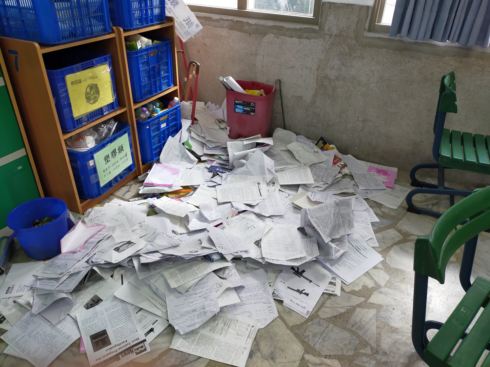

# 高中選修化學2 3-1反應速率
chemical reaction rate

## 動機
在化學課時發現這可以寫程式運算，比人工的效率高很多，因此打算製作一個程式負責這個需要高效率的任務。

## 過程
我用大約2個小時構思並編程，用C++製作並執行，因為有乘法與次方的部分，所以我使用對數讓其簡化，再利用之前數學的高斯消去法把需要的值算出。這項目在開發過程並沒有碰到嚴重的困難，為中偏易。

## 心得
由於數學課時已經寫過高斯消去法的程式，所以這個寫起來較得心應手，至於對數的想法是我在觀察其式子後發現的；並恰好數學課才剛上完高斯消去法，且也有完成的檔案可用，稍加修改即可變成計算反應速率的程式，至於k值只要用原本的底數處理即可得出。理論上只要實驗次數夠多次，就可以求出較精確的答案，然而事與願違，因為我那時偷懶，並沒有照高斯原本的想法編輯，且只要有錯誤產生(見數學那一段)程式就會終止運行，因此實驗時的數據不建議帶入，它只能算理論與課本設計好的數字，算是美中不足。但因為不可能做到十全十美，總會有漏洞，所以我短時間應該不會想修正它，除非有美國時間。

# 關於期末考的部分

考卷土石流，這很少見，通常是因為期末將至且考"完了"，書的存在並不是這麼的重要，因此開始瘋狂拋棄它們；堆積如山的考卷因磨擦力不足(微觀是電磁力)從回收桶墜落，掉到地板形成垃圾堆，因為一攤紙在那，加上破窗效應(同學的補刀)而形成考卷山丘，最後用了2小時和數次的搬運才清除。其中紙堆裡的數學課本被拿去"封印"一週沒倒的廚餘桶(這很常見但只在我們班)，不然裡面的各種微生物導致鍵結斷裂，進而各種有機物揮發，整個班上的味道會很豐富。

  
   

