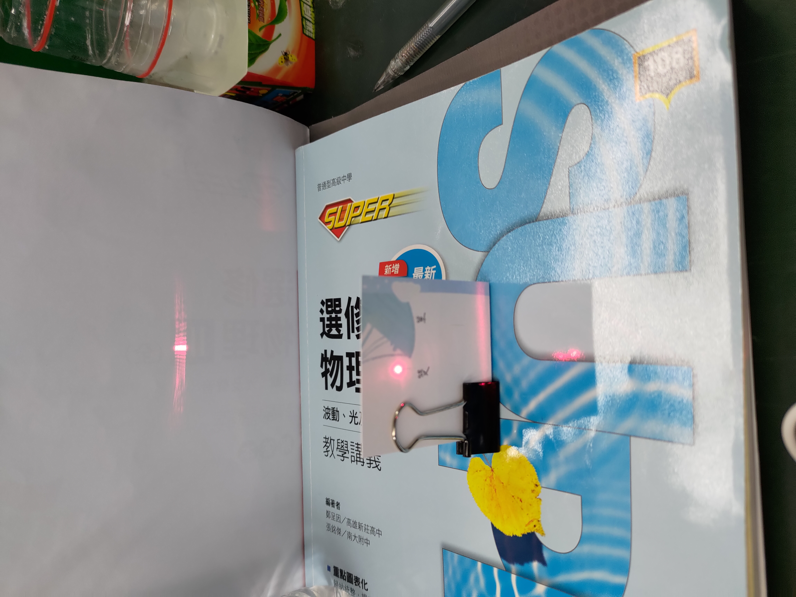
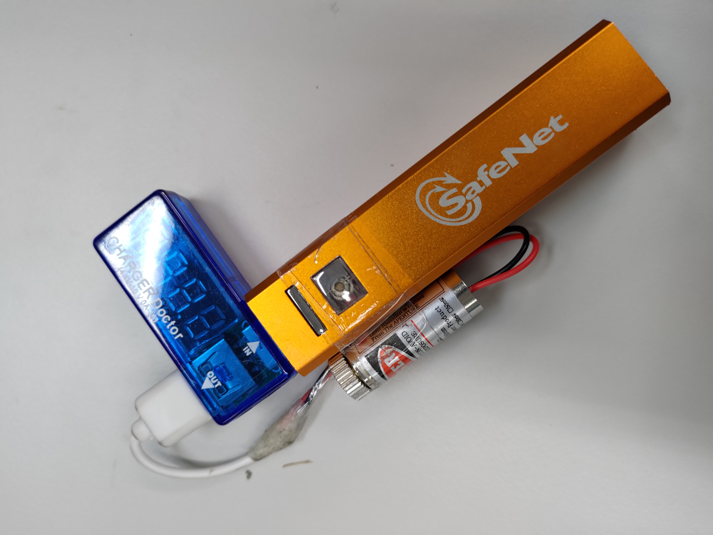
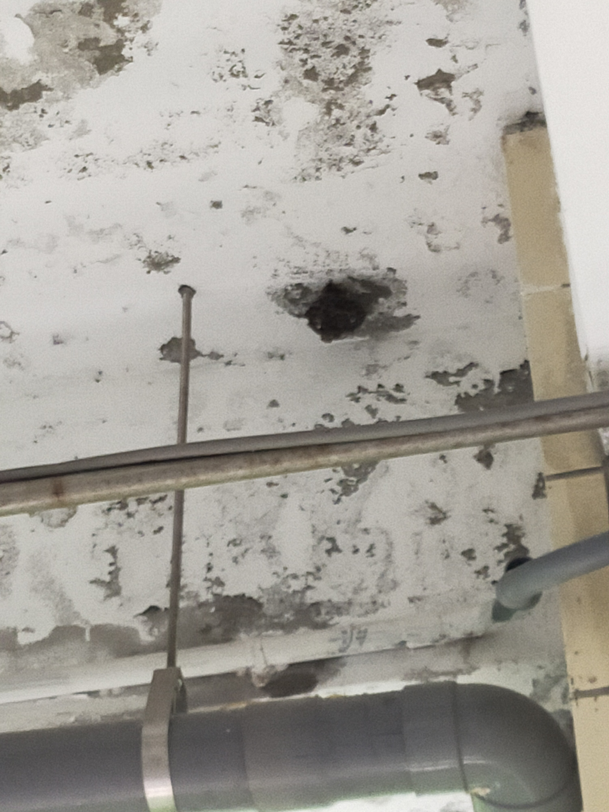

# 高中選修化學2 3-1反應速率
chemical reaction rate

## 動機
在化學課時發現這可以寫程式運算，比人工的效率高很多，因此打算製作一個程式負責這個需要高效率的任務。

## 過程
我用大約1個小時構思並編程，用C++製作並執行，因為有乘法與次方的部分，所以我使用對數讓其簡化，再利用之前數學的高斯消去法把需要的值算出。這項目在開發過程並沒有碰到嚴重的困難，為中偏易。

## 心得
由於數學課時已經寫過高斯消去法的程式，所以這個寫起來較得心應手，至於對數的想法是我在觀察其式子後發現的；並恰好數學課才剛上完高斯消去法，且也有完成的檔案可用，稍加修改即可變成計算反應速率的程式，至於k值只要用原本的底數處理即可得出。理論上只要實驗次數夠多次，就可以求出較精確的答案，然而事與願違，因為我那時偷懶，並沒有照高斯原本的想法編輯，且只要有錯誤產生(見數學那一段)程式就會終止運行，因此實驗時的數據不建議帶入，它只能算理論與課本設計好的數字，算是美中不足。但因為不可能做到十全十美，總會有漏洞，所以我短時間應該不會想修正它，除非有美國時間。
 
 
 
 
 

# 難道只偏愛化學？不！物理是這樣玩的

## 動機
在課堂上教到光的干涉與繞射，剛好我的裝備裡有雷射筆，因此在下課後就開始實驗。

## 過程
先用美工刀在卡片上分別割出一條和兩條平行線，然後用長尾夾固定並立起卡片，再把物理講義的空白面立起當作屏幕，最後調整光源，觀察現象。

## 心得
從這個單元中，我學到如何快速地設計實驗，並把現象記錄下來。過程中發現干涉條紋會有雜點，因為紙的纖維沒有被切割乾淨，後來用力切割後把這個問題解決。課程令自己成長最多快速解決問題與設計實驗的能力，這能用在任何地方，包括但不限於自然研究。並且因肉眼見到真實現象，使我在該章節時更容易明白老師上課所述，也可以間接驗證理論的正確性，並因此增強批判思考的能力，因為有時講義或課本也有出錯的時候(見選化三)，甚至理論也可能被後人推翻。

  
   

下圖是用過時的行動電源改裝的雷射筆，順便附贈伏安計當手柄 

  

 
 
 
 
 

# 既然有物理，那就少不了物理攻擊
你知道的嘛，身為人不做死總會感覺少了點什麼。這一次是挑戰馬蜂窩，並且裝備了最自豪也是最痛的遠程武器--橡皮筋，利用其彈性位能轉成動能與部分熱能進行遠程物理傷害，要找彈性常數大的攻擊效果最好。First，先從班級門口往馬峰窩試射一發橡皮筋，umm...，笑果不錯；再一個拉滿弓，結果一不小心就直接損壞部分的殼，同時也被老師關切(因為太危險了)。後來，~~我總算學會了如何去愛(劉若英-後來)~~，有個同學想要挑戰極限，用拖把進行近戰，直接閃擊馬蜂窩，主打一個速度快攻，幸好馬蜂跑得快，沒有被波及到，同學也沒有受傷。就這樣玩了幾天，週五放學時學校才派人把這個大麻煩移除掉。

  
   

